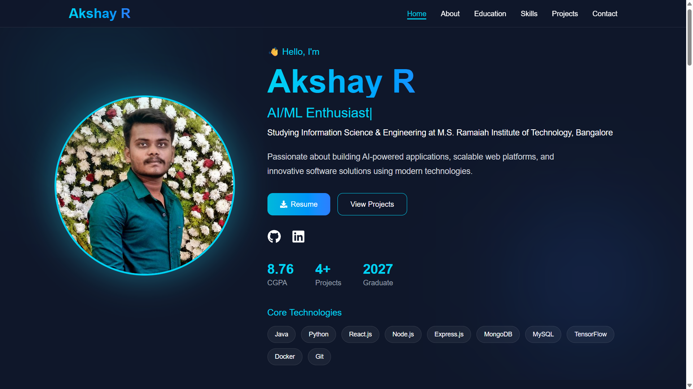

# 🚀 Akshay R — Personal Portfolio Website

<div align="center">


### Full Stack Developer • AI & ML Enthusiast • Software Engineer

<p align="center">
  
  
  
  
  
</p>

<br/>


</div>


---

# 🌟 Overview

This portfolio website serves as a central hub showcasing my technical expertise, projects, educational background, achievements, and professional journey.

Built with modern web technologies, the platform highlights my passion for:

* 🚀 Full Stack Development
* 🤖 Artificial Intelligence
* 🧠 Machine Learning
* 💻 Software Engineering
* 📊 Data-Driven Applications
* 🌐 Modern Web Technologies

The website is designed with a responsive architecture, smooth animations, and an intuitive user experience to effectively present my work and capabilities.

---

# 👨💻 About Me

Hi, I'm **Akshay R**, an Information Science & Engineering student with a strong interest in building innovative software solutions that solve real‑world problems.

I specialize in developing:

### 🌐 Full Stack Applications

* MERN Stack Development
* REST APIs
* Database Design
* Authentication Systems

### 🤖 Artificial Intelligence

* Machine Learning Models
* Deep Learning Applications
* Computer Vision Systems
* Natural Language Processing

### 📈 Software Engineering

* Scalable System Design
* Problem Solving
* Application Development
* Modern Development Practices

I continuously explore emerging technologies and strive to bridge the gap between software engineering and artificial intelligence.

---
# ✨ Portfolio Features

<div align="center">

### 🚀 Crafted for Performance, User Experience & Professional Presentation


</div>

---

## 🎨 Modern User Experience

<table>
<tr>
<td width="50%">

✅ Professional Hero Section

✅ Smooth Framer Motion Animations

✅ Fully Responsive Design

✅ Modern UI Components

✅ Interactive Navigation

✅ Performance Optimized

</td>

<td width="50%">

✅ Elegant Visual Design

✅ Fast Loading Experience

✅ Mobile-First Architecture

✅ Enhanced Accessibility

✅ Seamless User Journey

✅ Clean & Maintainable Codebase

</td>
</tr>
</table>

---

## 📚 Professional Portfolio Sections

<table>
<tr>
<td width="50%">

✅ Hero Section

✅ About

✅ Education 

✅ Skills

✅ Projects

✅ Contact Section

</td>
</tr>
</table>


---

# 🖼️ Live Portfolio Preview

<div align="center">

### 🚀 Explore My Interactive Portfolio Website

A modern, responsive, and professionally designed portfolio showcasing my skills, projects, achievements, and technical expertise in Full Stack Development, Artificial Intelligence, and Machine Learning.

<br>



<br><br>

<a href="https://akshay-r-portfolio.vercel.app/" target="_blank">
  
</a>

<a href="https://github.com/Akshay001-A" target="_blank">
  
</a>

</div>


--


## 🌟 Portfolio Highlights

🔹 Professional Developer Branding

🔹 Interactive User Experience

🔹 AI & Full Stack Project Showcase

🔹 Recruiter-Friendly Layout

🔹 Modern Design Principles

🔹 Scalable & Maintainable Architecture

---


# 🛠️ Technology Stack

## Frontend Development

| Technology    | Purpose        |
| ------------- | -------------- |
| React.js      | User Interface |
| TypeScript    | Type Safety    |
| Tailwind CSS  | Styling        |
| Framer Motion | Animations     |
| Vite          | Build Tool     |

---

## Backend & Databases

| Technology | Purpose             |
| ---------- | ------------------- |
| Node.js    | Backend Development |
| Express.js | REST APIs           |
| MongoDB    | NoSQL Database      |
| MySQL      | Relational Database |
| Flask      | Python Backend      |

---

## Artificial Intelligence & Machine Learning

| Technology     | Purpose          |
| -------------- | ---------------- |
| TensorFlow     | Deep Learning    |
| Scikit-Learn   | Machine Learning |
| Keras          | Neural Networks  |
| Librosa        | Audio Processing |
| EfficientNetV2 | Computer Vision  |

---

## Development Tools

| Tool    | Purpose                 |
| ------- | ----------------------- |
| Git     | Version Control         |
| GitHub  | Collaboration           |
| Docker  | Containerization        |
| VS Code | Development Environment |
| EmailJS | Contact Integration     |

---

# 🚀 Featured Projects

## 🎙️ Deepfake Audio Detection

An AI‑powered audio forensic platform that identifies synthetic and AI‑generated speech using advanced machine learning algorithms and audio feature extraction techniques.

### Technologies Used

* Python
* Flask
* Scikit‑Learn
* Librosa
* Machine Learning

---

## 🌱 Potato Plant Disease Recognition

A deep learning application capable of identifying potato leaf diseases and providing intelligent treatment recommendations for improved agricultural productivity.

### Technologies Used

* TensorFlow
* EfficientNetV2
* Flask
* MongoDB
* Deep Learning

---

## 👟 Shoe Mart — AI E‑Commerce Platform

A modern AI‑powered footwear marketplace featuring visual search capabilities, intelligent recommendations, responsive UI, and advanced backend architecture.

### Technologies Used

* React.js
* Node.js
* MongoDB
* Gemini AI
* OpenCLIP

---

## 🏋️ Gym Management System

A desktop application developed to streamline gym administration, membership management, subscriptions, and operational workflows.

### Technologies Used

* Java
* Swing
* MySQL
* JDBC

---

## 📚 Flash Learn

An interactive educational platform focused on improving learning efficiency through flashcards, quizzes, and knowledge retention techniques.

### Technologies Used

* React
* JavaScript
* CSS
* Interactive Learning Systems

---
# 🌐 Connect With Me

<div align="center">

### 🚀 Let's Build Something Amazing Together

<p align="center">
  <a href="mailto:akshay02072005@gmail.com">
    
  </a>

  <a href="https://www.linkedin.com/in/akshayofficial0207">
    
  </a>

  <a href="https://github.com/Akshay001-A">
    
  </a>

  <a href="https://www.instagram.com/akshay_authentic">
    
  </a>
</p>

<br>


</div>

---

### 💼 Professional Interests

🔹 Full Stack Development  
🔹 Artificial Intelligence & Machine Learning  
🔹 Software Engineering  
🔹 Open Source Contributions  
🔹 Research & Innovation  
🔹 Internship & Career Opportunities  

---

# 📄 Resume

The latest version of my resume can be viewed and downloaded directly from the portfolio website.

---

# ⚙️ Installation Guide

## Clone Repository

```bash
git clone https://github.com/Akshay001-A/portfolio.git
```

---

## Navigate To Project

```bash
cd portfolio
```

---

## Install Dependencies

```bash
npm install
```

---

## Run Development Server

```bash
npm run dev
```

---

## Build Production Version

```bash
npm run build
```

---

## Preview Production Build

```bash
npm run preview
```

---

# 🎯 Future Enhancements

✨ Dark / Light Theme Toggle
✨ Dynamic Blog Section
✨ GitHub Contribution Graph
✨ Project Search & Filtering
✨ Advanced Animations
✨ Visitor Analytics Dashboard
✨ Custom Domain Integration
✨ AI‑Powered Portfolio Assistant

---

# 🤝 Contributions

While this is a personal portfolio project, suggestions and improvements are always welcome.

Feel free to:

* Fork the repository
* Submit improvements
* Report issues
* Share feedback

---

# 📄 License

This project is licensed under the **MIT License**.

See the LICENSE file for additional information.

---

<div align="center">

## ⭐ If You Like This Portfolio, Give It A Star ⭐


</div>

---
